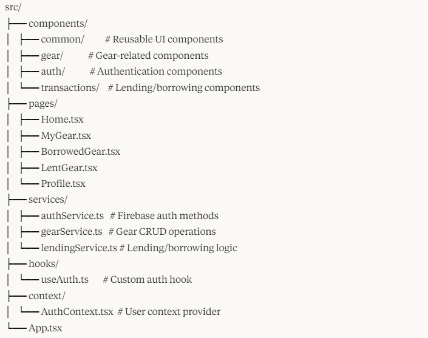

<invoke name="artifacts">
<parameter name="command">create</parameter>
<parameter name="id">readme_file</parameter>
<parameter name="type">text/markdown</parameter>
<parameter name="title">README.md</parameter>
<parameter name="content"># GearShare - Gear Borrowing Application

A Progressive Web App (PWA) for managing gear lending and borrowing between users.

## 📋 Overview

GearShare is a platform that allows users to:
- Register their gear items
- Lend gear to other users
- Borrow gear from others
- Track lending/borrowing history

The application works seamlessly across both desktop and mobile devices, with Google account authentication for secure user management.

## 🛠️ Technology Stack

### Frontend
- **Framework**: React.js with TypeScript
- **UI Library**: Material-UI / Tailwind CSS
- **State Management**: Redux Toolkit / React Context API
- **PWA Features**: Workbox

### Backend
- **Firebase Ecosystem**:
  - Firebase Authentication (Google sign-in)
  - Firestore (NoSQL database)
  - Firebase Storage (for gear images)
  - Firebase Hosting
  - Firebase Cloud Functions

## 🏗️ Project Structure

## ✨ Key Features

### Authentication
- Google account sign-in integration
- User profiles with lending/borrowing history
- Authentication state persistence

### Gear Management
- Add, edit, and remove gear items
- Upload gear images
- Categorize gear by type
- Set availability status

### Lending System
- Request to borrow gear
- Approve/reject lending requests
- Set lending duration
- Track current status of lent/borrowed items
- Return confirmation process

### Notifications
- Lending request notifications
- Return reminders
- Request status updates

### PWA Features
- Installable on desktop and mobile devices
- Offline functionality for viewing owned and borrowed gear
- Push notifications (where supported)
- Responsive design for all screen sizes
